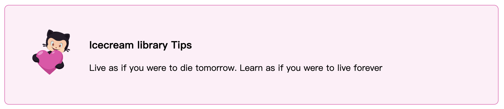
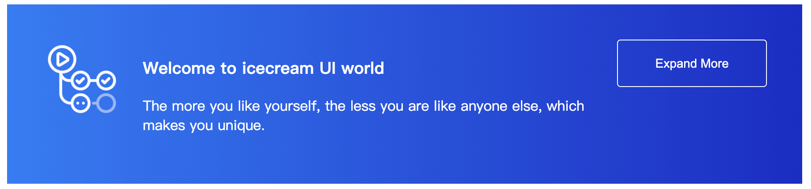
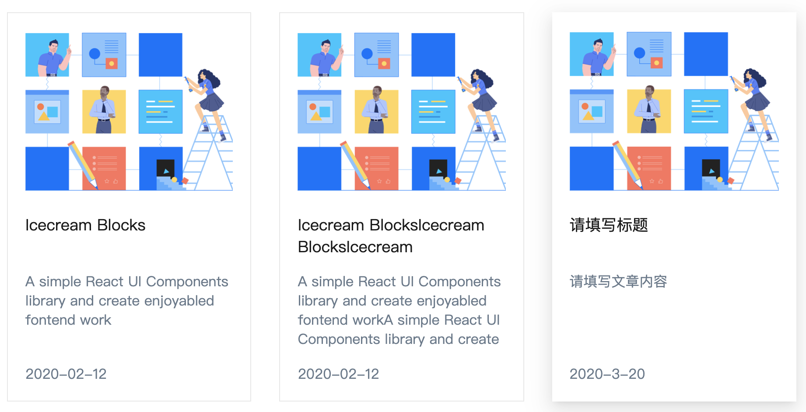

# Icecream Design

A simple React UI Components library and create enjoyabled fontend work.





## 📦 Install

Offical Website: [cloud-wave.cn](https://cloud-wave.cn/)
```bash
npm install icecreamd
# or
yarn add icecreamd
```
## 🔨 Usage

```js
// import your wanted components
import { Button } from 'icecreamd';
// import css
import 'icecreamd/lib/Button/style/index.css';

<Button type="primary">
  Getting Start
</Button>
```

